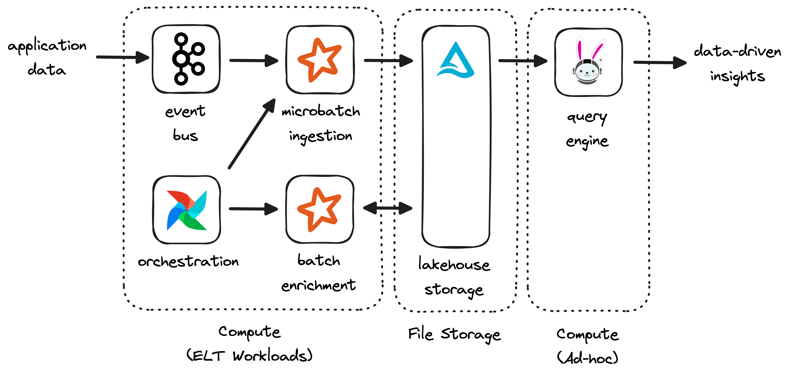

# apache-sample
An apache data system written for development on a local cluster and incramental modifications for production environments.

## System Design



- `Kafka` event source to ingest realtime application data
- `Spark` framework for microbatch and batch processes
- `Airflow` orchestration of microbatch and batch processes
- `Delta` ACID-compliant storage layer on file storage
- `Trino` analytics query engine for ad-hoc analysis

## System Tests

An end-to-end test of the system can be run from docker-desktop. The test:

1. publishes sample data to a topic on the kafka cluster
2. ingests the data into a staging table on delta using structured-streaming
3. performs windowed aggregations on the data and saves the results
4. triggers a sql analytics query through trino to simulate an analyst

The tests can be triggered from the tests module.


## Developer Notes

### Testing in the Development Environment
Ensure docker desktop is running
```shell
open -a Docker
kubectl config use-context docker-desktop
```

Build docker images for the kafka producer and spark jobs
```shell
make kafka-producer-image
make spark-jobs-image
```

Run the system tests
```shell

```


### Modifying for a Production Environment

1. Scale the kafka cluster and spark streaming jobs
2. Change the batch job deployment to run on an ephemeral cluster
3. Change the storage configuration to cloud storage
4. Scale the trino cluster for more performant queries
