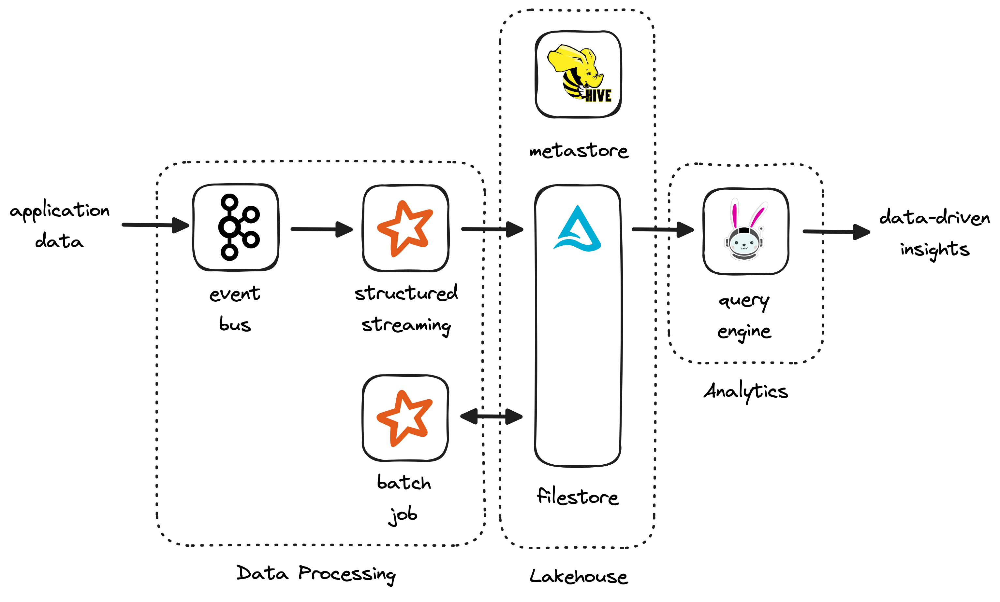

# apache-sample
Helm charts and source code for an apache data application.

## System Design

`Kafka`: event source to ingest realtime application data

`Spark`: framework for microbatch and batch processes

`Airflow`: orchestration of microbatch and batch processes

`Delta`: ACID-compliant storage layer on file storage

`Trino` analytics query engine for ad-hoc analysis

## System Tests

An end-to-end test of the system can be run from minikube. The application:

1. publishes sample data to a test topic on the kafka cluster
2. ingests the data into a staging table on delta using structured-streaming
3. performs windowed aggregations on the data and saves the results
4. triggers a sql query through trino to simulate an end-user

The tests can be triggered from the tests module with pytest.